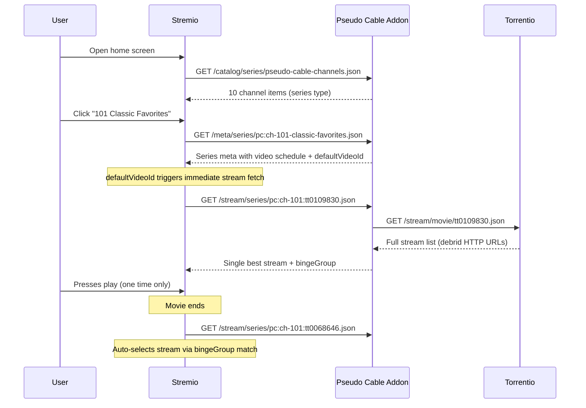

# Series Model Architecture — Pseudo Cable v2

This document is the authoritative reference for the next phase of development.
It supersedes the approaches explored in PR #5 (`feat/autoplay-option1-2-batch`)
and the earlier `docs/autoplay-approaches.md`.

**Read this entire document before writing any code.**

---

## Table of Contents

1. [Product Context](#1-product-context)
2. [User Flow](#2-user-flow)
3. [Architecture Overview](#3-architecture-overview)
4. [ID Scheme](#4-id-scheme)
5. [Manifest](#5-manifest)
6. [Catalog Handler](#6-catalog-handler)
7. [Meta Handler](#7-meta-handler)
8. [Stream Handler](#8-stream-handler)
9. [Config Changes](#9-config-changes)
10. [Type Changes](#10-type-changes)
11. [Stream Ranking (Reuse from PR #5)](#11-stream-ranking-reuse-from-pr-5)
12. [bingeGroup Strategy](#12-bingegroup-strategy)
13. [Caching and Staleness](#13-caching-and-staleness)
14. [Known Limitations](#14-known-limitations)
15. [Files Changed](#15-files-changed)
16. [What This Does NOT Change](#16-what-this-does-not-change)
17. [Testing](#17-testing)
18. [Legal Boundary (unchanged)](#18-legal-boundary-unchanged)

---

## 1. Product Context

### Who this is for

This addon targets people who are **unfamiliar with streaming** — users who find
Stremio's browse/search/source-selection workflow overwhelming. The goal is
to make Stremio feel like cable TV: you pick a channel, press play once, and
movies keep coming.

### Simplicity requirement

Every design decision must be evaluated against this question:
**"Does this reduce the number of choices the user has to make?"**

Specifically:
- Users should see channels on the **Stremio home screen** (Board) without
  navigating anywhere.
- Channels they've watched before should appear in **Continue Watching** —
  the first thing users see when they open Stremio.
- Users can **save channels to their Library** for persistent access.
- Clicking a channel should **start playing immediately** with no intermediate
  episode list or source selection dialog.
- When a movie ends, the **next movie starts automatically** with zero
  interaction.

### Non-goals

- This addon does not host, transcode, or distribute media.
- This addon does not replace or interfere with other Stremio addons.
- This addon does not require the user to understand what Torrentio is or how
  debrid services work — the person who sets up the addon configures that once.

---

## 2. User Flow

This is the target experience. Implementation must achieve this flow.

### First-time setup (done once by whoever installs the addon)

1. Configure the addon with a Torrentio manifest URL (includes the user's
   debrid/filter config baked into the URL path).
2. Install the addon in Stremio.

### First-time channel use

1. User opens Stremio.
2. User sees a **"Pseudo Cable"** row on the home screen (Board) with channel
   posters. Each poster ideally shows what's currently airing (future: dynamic
   movie poster; MVP: channel branding or placeholder).
3. User clicks a channel (e.g., "101 Classic Favorites").
4. Stremio opens the channel detail page. Because `defaultVideoId` is set to
   the current "Now Playing" slot, the stream handler is **triggered
   immediately** — no episode list navigation required.
5. The addon proxies Torrentio server-side, ranks results, and returns a
   single stream with a `bingeGroup`.
6. The movie starts playing.
7. User adds the channel to their Library (one-time step — Stremio shows an
   "Add to Library" button on the detail page).

### Repeat use (the target "cable TV" experience)

1. User opens Stremio.
2. The channel appears in **Continue Watching** (the first section on the
   home screen) because it's in the user's Library and they've watched it before.
3. User clicks the channel.
4. Current movie starts playing immediately (via `defaultVideoId`).
5. Movie ends → `bingeGroup` triggers auto-play → next scheduled movie starts.
6. Repeat indefinitely. The user never leaves the couch.

### Browsing the schedule (optional, for curious users)

1. User clicks a channel and scrolls past the auto-playing stream.
2. The series detail page shows the upcoming schedule as "episodes" — each
   one is a time slot with the movie title and airing time.
3. User can click any upcoming slot to jump ahead in the schedule.

```
┌──────────────────────────────────────────────────────────┐
│                    STREMIO HOME SCREEN                    │
├──────────────────────────────────────────────────────────┤
│                                                          │
│  Continue Watching                                       │
│  ┌─────────┐ ┌─────────┐ ┌─────────┐                   │
│  │ 101     │ │ 105     │ │ Netflix │  ← channels the    │
│  │ Classic │ │ Western │ │ Show... │    user has watched │
│  │ Favs    │ │ Channel │ │         │    before           │
│  └─────────┘ └─────────┘ └─────────┘                   │
│                                                          │
│  Pseudo Cable                         ← addon catalog    │
│  ┌─────────┐ ┌─────────┐ ┌─────────┐ ┌─────────┐      │
│  │ 101     │ │ 102     │ │ 103     │ │ 104     │  ... │
│  │ Classic │ │ Crime & │ │ Family  │ │ Western │      │
│  │ Favs    │ │ Suspense│ │ Movie   │ │ Round.  │      │
│  └─────────┘ └─────────┘ └─────────┘ └─────────┘      │
│                                                          │
│  Popular Movies                       ← other addons    │
│  ...                                                     │
└──────────────────────────────────────────────────────────┘

         User clicks "101 Classic Favorites"
                       │
                       ▼
┌──────────────────────────────────────────────────────────┐
│  101 Classic Favorites                                   │
│  ─────────────────────                                   │
│  [▶ Play]  [+ Library]          ← defaultVideoId makes  │
│                                   Play go to current slot│
│  Now: Forrest Gump (11:00 AM - 1:00 PM)                │
│  Up Next: The Godfather (1:00 PM - 3:00 PM)            │
│  Later: Casablanca (3:00 PM - 5:00 PM)                 │
│  ...                                                     │
└──────────────────────────────────────────────────────────┘

         User presses Play (one time only)
                       │
                       ▼
         Forrest Gump starts playing
                       │
                       ▼ (movie ends)
         The Godfather auto-plays via bingeGroup
                       │
                       ▼ (movie ends)
         Casablanca auto-plays via bingeGroup
                       │
                       ▼ ...forever
```

---

## 3. Architecture Overview

The core trick: exploit Stremio's `bingeGroup` auto-continuation for series
episodes. Each channel becomes a Stremio "series", each scheduled time slot
becomes an "episode", and the addon provides a single proxied stream per
episode with a stable `bingeGroup`. After the user presses play once,
subsequent movies auto-advance.

```
┌─────────┐     ┌─────────────┐     ┌───────────────┐     ┌───────────┐
│  User   │────▶│   Stremio   │────▶│ Pseudo Cable  │────▶│ Torrentio │
│         │     │   Client    │     │   Addon       │     │ (debrid)  │
└─────────┘     └─────────────┘     └───────────────┘     └───────────┘
                       │                    │
                  catalog req          proxy stream
                  meta req             rank results
                  stream req           return 1 stream
                       │               + bingeGroup
                  auto-play via            │
                  bingeGroup match         │
```

### Sequence diagram



---

## 4. ID Scheme

This is critical to understand. The ID scheme is what separates our addon's
stream pipeline from every other addon.

### Channel (meta) IDs

Format: `pc:{channelSlug}`

Examples:
- `pc:ch-101-classic-favorites`
- `pc:ch-108-scifi-adventures`

These are used in the catalog and meta handlers. The `pc:` prefix combined
with `idPrefixes: ["pc"]` in the manifest means only our addon handles
meta/stream requests for these IDs. Torrentio and all other addons ignore them.

### Video (episode/slot) IDs

Format: `pc:{channelSlug}:{imdbId}`

Examples:
- `pc:ch-101-classic-favorites:tt0109830` (Forrest Gump on channel 101)
- `pc:ch-101-classic-favorites:tt0068646` (The Godfather on channel 101)

These are used in the stream handler. When Stremio requests streams for a
video ID, the addon:
1. Parses the IMDb ID from the video ID
2. Fetches Torrentio with the IMDb ID
3. Returns a single ranked stream with the channel's `bingeGroup`

### Why this works

- Only our addon responds to `pc:` prefixed IDs → no duplicate streams in UI
- We can embed both the channel context and the actual movie ID in one string
- The IMDb ID extraction lets us query Torrentio's movie endpoint directly

### Important constraint

Channel slugs (the `{channelSlug}` portion) **must not contain colons**.
The current config uses slugs like `ch-101-classic-favorites` which are safe.
If channel config format ever changes, this invariant must be preserved.

---

## 5. Manifest

Replace the current manifest entirely.

```typescript
const manifest = {
  id: "org.local.pseudocable",
  version: "0.2.0",
  name: "Pseudo Cable",
  description: "Cable TV channels for Stremio. Pick a channel, press play, movies keep coming.",
  resources: ["catalog", "meta", "stream"],
  types: ["series"],
  idPrefixes: ["pc"],
  catalogs: [
    {
      id: "pseudo-cable-channels",
      type: "series",
      name: "Pseudo Cable"
    }
  ],
  behaviorHints: {
    configurable: false
  }
};
```

### Key changes from current manifest

| Property | Current (v0.1) | New (v0.2) |
|----------|---------------|------------|
| `types` | `["movie"]` | `["series"]` |
| `resources` | `["catalog", "meta"]` | `["catalog", "meta", "stream"]` |
| `idPrefixes` | `["tt"]` | `["pc"]` |
| `catalogs` | 2 catalogs with required `channelId` extra | 1 catalog, no required extras |

### Why no required extras on the catalog

Catalogs with required `extra` parameters **do not appear on the Stremio Board
(home screen)**. Removing the required `channelId` extra means the "Pseudo
Cable" row shows up automatically on the home screen alongside other addon
content. This is essential for the simplicity requirement.

---

## 6. Catalog Handler

The catalog returns one meta preview item per channel.

```typescript
// For each channel in config:
{
  id: "pc:ch-101-classic-favorites",    // pc:{channelSlug}
  type: "series",
  name: "101 Classic Favorites",
  poster: "https://via.placeholder.com/300x450?text=101+Classics",  // MVP placeholder
  description: "Classic favorites with predictable rotation. Now showing: Forrest Gump.",
  // No genres, posterShape, etc. needed for MVP
}
```

### Catalog name should reflect what's on now

For the simplicity-first audience, the `description` field should include
what's currently airing. This way, even the Board row gives users a sense
of "what's on" without clicking into anything.

Future enhancement: use the currently-airing movie's poster as the channel
poster image (fetch from TMDB or similar). This makes the Board row visually
show 10 movie posters — immediately informative.

---

## 7. Meta Handler

When Stremio requests meta for a channel (e.g., `pc:ch-101-classic-favorites`),
return a series meta with a `videos` array representing the live schedule.

```typescript
{
  meta: {
    id: "pc:ch-101-classic-favorites",
    type: "series",
    name: "101 Classic Favorites",
    description: "Classic favorites scheduled with predictable rotation.",
    // poster, background, logo — future enhancement

    behaviorHints: {
      defaultVideoId: "pc:ch-101-classic-favorites:tt0109830"
      // ^ current "Now Playing" slot's video ID
      // This makes Stremio skip the episode list and go straight to streams
    },

    videos: [
      {
        id: "pc:ch-101-classic-favorites:tt0109830",
        title: "Now: Forrest Gump",
        released: "2026-03-03T16:00:00.000Z",  // slot start ISO
        season: 1,
        episode: 1,
        overview: "11:00 AM – 1:00 PM"
      },
      {
        id: "pc:ch-101-classic-favorites:tt0068646",
        title: "Up Next: The Godfather",
        released: "2026-03-03T18:00:00.000Z",
        season: 1,
        episode: 2,
        overview: "1:00 PM – 3:00 PM"
      },
      // ... up to 5-6 upcoming slots
    ]
  }
}
```

### Design decisions

- **`defaultVideoId`**: Set to the current "Now Playing" slot. This is
  critical for the one-click flow — Stremio opens directly to the stream
  for the current slot instead of showing the episode list.

- **`season: 1` for all videos**: Stremio's series UI groups by season.
  Putting all slots in season 1 keeps the schedule in a single flat list,
  which matches the mental model of a channel schedule.

- **`episode: 1, 2, 3...`**: Sequential numbering (current slot = 1, next = 2,
  etc.) gives Stremio proper ordering within the season.

- **`released` timestamps**: Use slot start times in ISO 8601. This ensures
  chronological ordering and gives Stremio date context for display.

- **`overview`**: Use for time range display (e.g., "11:00 AM – 1:00 PM").
  Keeps the title clean while still showing schedule info.

- **Regenerated on every request**: The videos array always reflects the
  current real-time schedule. Each request computes the current slot and
  upcoming slots fresh.

---

## 8. Stream Handler

New file: `src/stream.ts`

This is the core innovation — the piece that makes auto-play work.

### Request flow

1. Stremio requests `GET /stream/series/{videoId}.json`
2. Parse video ID: `pc:ch-101-classic-favorites:tt0109830` →
   channel slug `ch-101-classic-favorites`, IMDb ID `tt0109830`
3. If no `streamSourceUrl` is configured → return `{ streams: [] }`
4. Fetch `{streamSourceBase}/stream/movie/{imdbId}.json` via HTTP
5. Parse Torrentio's response (array of stream objects)
6. Rank streams using quality-first ranking (see section 11)
7. Pick the top-ranked stream
8. Attach `behaviorHints.bingeGroup` (see section 12)
9. Return exactly 1 stream

### Response format

```typescript
{
  streams: [
    {
      url: "https://debrid-provider.example/dl/abc123/movie.mkv",
      name: "Pseudo Cable",
      description: "1080p • Forrest Gump",
      behaviorHints: {
        bingeGroup: "pseudo-cable-ch-101-classic-favorites",
        notWebReady: true  // debrid URLs typically need this
      }
    }
  ]
}
```

### Error handling

- **Torrentio unreachable**: return `{ streams: [] }`. User can still browse
  the schedule; Stremio will show "no streams available" for that slot.
- **Torrentio returns empty results**: return `{ streams: [] }`.
- **Timeout**: use a reasonable timeout (8-10 seconds) on the fetch.

### Important: empty streams break auto-play chain

If any slot in the schedule returns empty streams, `bingeGroup` auto-continuation
**stops at that slot**. The user would need to manually click the next slot.
This is a known limitation. Mitigation: ensure the program library uses
well-known titles that Torrentio is likely to have.

---

## 9. Config Changes

### `src/types.ts` — add `streamSourceUrl`

```typescript
export type ChannelConfigFile = {
  channels: ChannelConfig[];
  streamSourceUrl?: string;
};
```

### `src/config.ts` — load stream source URL

- Read from config file's `streamSourceUrl` field
- Also support `STREAM_SOURCE_URL` environment variable (env takes precedence)
- Strip trailing `/manifest.json` from the URL to get the base path
- Example input: `https://torrentio.strem.fun/qualityfilter=480p,scr,cam|debridoptions=nocatalog/manifest.json`
- Stored as: `https://torrentio.strem.fun/qualityfilter=480p,scr,cam|debridoptions=nocatalog`

### `config/channels.example.json` — add example field

```json
{
  "streamSourceUrl": "https://torrentio.strem.fun/YOUR_CONFIG_HERE/manifest.json",
  "channels": [ ... ]
}
```

---

## 10. Type Changes

### `src/global.d.ts`

Add `defineStreamHandler` to the stremio-addon-sdk type declarations.
The current `global.d.ts` only declares catalog and meta handlers. The stream
handler follows the same pattern:

```typescript
defineStreamHandler(handler: (args: { type: string; id: string }) => Promise<{ streams: StreamObject[] }>): void;
```

Where `StreamObject` should include at minimum:
- `url?: string`
- `name?: string`
- `description?: string`
- `behaviorHints?: { bingeGroup?: string; notWebReady?: boolean; [key: string]: unknown }`

---

## 11. Stream Ranking (Reuse from PR #5)

PR #5 (`feat/autoplay-option1-2-batch` / `feat/autoplay-single-stream-bingegroup`)
contains well-tested stream ranking logic in `src/autoplay.ts`. The ranking
approach should be **adapted** (not copied verbatim) for the new stream handler.

### What to keep from PR #5

- **Quality scoring**: `2160p (5) > 1080p (4) > 720p (3) > 480p (2) > 360p (1)`
- **Quality inference from stream name/title**: regex matching for resolution
  strings in the stream's `name`, `title`, and `quality` fields
- **Deterministic tie-breaking**: sort by stable identity key so the same
  input always produces the same output
- **`selectSingleStream()` pattern**: rank all candidates, return only the best one

### What to change from PR #5

- **`bingeGroup` format**: PR #5 used `pc-{channelId}-{source}-{quality}`.
  The new format should be `pseudo-cable-{channelSlug}` — stable per channel,
  **not** per quality or per source addon. This is important because different
  movies on the same channel may have different best-available qualities.
  A per-channel bingeGroup ensures auto-continuation always works.

- **`StreamCandidate` type**: PR #5 defined custom types. Adapt these to match
  the actual Torrentio response format (which returns standard Stremio stream
  objects). The ranking function should accept the stream objects Torrentio
  returns and not require a custom intermediate type.

- **No `addonId` / `addonName` / `reliability` fields**: Torrentio's response
  doesn't include these. The ranking should work with `name`, `title`, and
  the stream URL/infoHash. Torrentio's stream `name` field typically contains
  the quality info (e.g., `"Torrentio\n1080p"` or `"[RD+] Torrentio"`).

### Reference: PR #5 branch

The code is on branch `origin/feat/autoplay-single-stream-bingegroup` in these
files:
- `src/autoplay.ts` — ranking logic, bingeGroup generation, single-stream selection
- `src/autoplay.invariants.ts` — tests for deterministic behavior

These files are NOT on `main`. Reference the branch to adapt the logic.

---

## 12. bingeGroup Strategy

### Format

```
pseudo-cable-{channelSlug}
```

Example: `pseudo-cable-ch-101-classic-favorites`

### Why per-channel (not per-quality or per-source)

The old PR #5 approach used `pc-{channelId}-{source}-{quality}`, which meant
the bingeGroup would change if:
- Movie A's best stream was 1080p but Movie B's best was 720p
- The debrid source name varied between requests

This would break auto-continuation. A per-channel bingeGroup is stable
regardless of what specific stream qualities are available for each movie.

### How bingeGroup auto-continuation works

1. User plays episode 1 (Forrest Gump). Stream has
   `bingeGroup: "pseudo-cable-ch-101-classic-favorites"`.
2. Movie ends. Stremio looks at episode 2 (The Godfather).
3. Stremio requests streams for episode 2 from all addons that handle the ID.
4. Our addon returns a stream with the **same** `bingeGroup`.
5. Stremio matches the bingeGroup → auto-selects and plays without user input.

### Platform limitation

`bingeGroup` auto-continuation **only works on the Stremio desktop client**.
On `web.stremio.com`, it opens a stream selection dialog instead. This is a
known Stremio bug (https://github.com/Stremio/stremio-bugs/issues/1021).
The addon should still work on the web client — users just need to click
"play" on each movie instead of getting auto-continuation.

---

## 13. Caching and Staleness

### The problem

The meta handler returns a dynamic schedule (current + upcoming slots). But
Stremio caches meta responses. If a user opens a channel, then comes back
2 hours later, they may see stale episodes that have already passed.

### Mitigations

1. **`defaultVideoId` always points to "now"**: Even if the episode list is
   stale, opening the channel jumps to the live current slot because the
   meta is re-fetched on detail page open.

2. **Stream handler is resilient to stale IDs**: If Stremio requests a stream
   for a video ID whose slot has passed, the addon should still serve it.
   The IMDb ID is in the video ID — the movie is still a valid movie regardless
   of whether its scheduled slot has passed. This prevents errors from stale
   cache references.

3. **Short cache hints (if SDK supports it)**: Investigate whether
   `stremio-addon-sdk`'s `serveHTTP` allows setting `Cache-Control` headers.
   A short TTL (e.g., 5-10 minutes) for meta responses would keep the
   schedule relatively fresh.

4. **In-memory stream cache**: Cache Torrentio responses for ~5 minutes.
   This avoids re-fetching the same movie's streams on rapid successive
   requests (e.g., if the user navigates away and back).

---

## 14. Known Limitations

| Limitation | Impact | Mitigation |
|-----------|--------|------------|
| `bingeGroup` doesn't work on Stremio web client | No auto-play on web; user must click each movie | Addon still works, just manual; this is a Stremio bug |
| Empty streams for a slot break the auto-play chain | User must manually click next slot | Use well-known titles; log missing streams |
| Stremio caches meta responses | Schedule may appear stale | `defaultVideoId` still works; stream handler handles stale IDs |
| No mid-slot offset | User always starts from beginning of movie | Stremio limitation; not addressable by addon |
| Debrid URL expiry | Unlikely but possible if stream is pre-fetched long before play | Streams are fetched on-demand per episode; low risk |
| Fixed slot durations don't match movie runtimes | Slot may end before/after movie finishes | Acceptable for cable feel; can improve later |

---

## 15. Files Changed

### Modified files

| File | Changes |
|------|---------|
| `src/types.ts` | Add `streamSourceUrl` to `ChannelConfigFile` |
| `src/config.ts` | Load stream source URL from config file and env var |
| `src/index.ts` | New manifest, rewritten catalog handler, rewritten meta handler, register stream handler |
| `src/global.d.ts` | Add `defineStreamHandler` type declaration |
| `config/channels.example.json` | Add `streamSourceUrl` example field |
| `README.md` | Updated setup guide for stream source configuration |
| `docs/mvp-plan.md` | Updated to reflect series model architecture |

### New files

| File | Purpose |
|------|---------|
| `src/stream.ts` | Stream handler: Torrentio proxy, ranking, bingeGroup logic |

### Test files

| File | Purpose |
|------|---------|
| `src/stream.invariants.ts` | NEW: Stream proxy tests (ID parsing, bingeGroup stability, empty stream handling) |
| `src/schedule.invariants.ts` | UNCHANGED: Schedule determinism tests still pass |

---

## 16. What This Does NOT Change

- **Schedule algorithm** (`src/schedule.ts`): Untouched. Still deterministic,
  still uses FNV-1a hashing, still supports anti-repeat windows.
- **Program library** (`src/library.ts`): Untouched. Same static map of
  IMDb IDs to program metadata.
- **Channel config format** (the `channels` array in config): Untouched.
  Only a new optional top-level `streamSourceUrl` field is added.
- **Legal boundary**: Still metadata-only. The stream handler proxies
  requests to the user's own configured Torrentio instance; it does not
  host or cache media files.

---

## 17. Testing

### Existing tests (must still pass)

- `npm run test` — schedule invariants (deterministic slotting, anti-repeat)

### New tests to add

**Stream handler tests** (`src/stream.invariants.ts`):

1. **ID parsing**: `pc:ch-101-classic-favorites:tt0109830` correctly extracts
   channel slug `ch-101-classic-favorites` and IMDb ID `tt0109830`

2. **bingeGroup stability**: Two different movies on the same channel produce
   the same `bingeGroup` string

3. **Empty input**: Empty stream array from Torrentio → returns `{ streams: [] }`

4. **Single stream output**: Non-empty Torrentio response → returns exactly
   1 stream with `bingeGroup` attached

5. **Ranking determinism**: Same stream candidates in different order →
   same winner selected

**Meta handler tests**:

6. **Videos array ordering**: Videos are returned in chronological order
   (episode 1 = current slot, episode 2 = next slot, etc.)

7. **`defaultVideoId` matches first video**: The `behaviorHints.defaultVideoId`
   equals the `id` of the first video in the array

8. **Video IDs contain channel slug**: Every video ID starts with
   `pc:{channelSlug}:`

---

## 18. Legal Boundary (unchanged)

This project is strictly:
- Metadata indexing
- Deterministic schedule generation
- Channel UX layer
- Stream request proxying (user's own configured source → user's own debrid)

This project is **not**:
- A streaming host
- A re-streamer or re-broadcaster
- A transcoder
- A DRM bypass mechanism
- A media cache or CDN

The stream handler forwards requests to the user's own Torrentio configuration
and returns the result. No media is stored, cached, or transformed by this addon.
